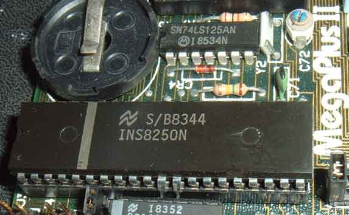
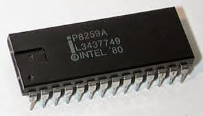
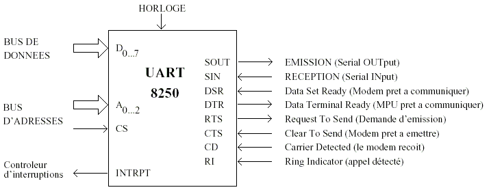

# HP48 Desktop

## Historique

 

Ce vieux projet sous DOS a été fait à l'époque pour plusieurs raisons:
- il était difficile de classer toutes les archives du [calculateur HP-48S/Sx/G/Gx](https://en.wikipedia.org/wiki/HP_48_series)
- avec l'utilisation du protocole KERMIT sur le port série RS232, la vitesse de transfert était vraiment trop lente
- et il y avait beaucoup trop de manipulations pour enchaîner plusieurs fichiers à la suite

```
Comme ELENDRIL et d'autres développeurs avaient sorti une lib HP48 pour faire des transferts en Xmodem alors
je me suis décidé à inclure cette fonctionnalité sous DOS en PASCAL + ASM.
A cette époque, je n'avais pas accès à un système de base de données alors je me suis créé mon propre format.
```

L'inspiration du moment était:
- les écrans des BBS en ASCII ART sous l'éditeur d'écrans DOS [TheDraw](https://en.wikipedia.org/wiki/TheDraw), affichés via ANSI.SYS
- le design ASCII des écrans avec "highlighted key shortcuts" à la sauce [Borland Turbo Vision](https://en.wikipedia.org/wiki/Turbo_Vision)
- les [couleurs EGA](https://en.wikipedia.org/wiki/Enhanced_Graphics_Adapter) de l'époque en mode texte 80x25 ou 80x43
- l'animation de tri des fiches de la base de données suivant la même logique que l'outil de défragmentation [DOS Norton Speed Disk](https://winworldpc.com/product/norton-utilities/50)

## Fonctionnalités

### Hardware

Le logiciel se base sur les composants de l'époque que l'on trouvait sur IBM/PC/XT/AT et les clônes x86.

| Gestionnaire du port série RS232 | Controlleur d'IRQ |
| ---------- | -------- |
|  |  |
| uart 8250  | intel 8259 |

Voici un diagramme simple des entrées/sorties de l'UART:


et utilisé dans le code suivant ces registres:

| Base Address| I/O Access | Abbrv. | Register Name |
| ----------- | ---------- | ------ | ------------- |
| +0 | Write | THR | Transmitter Holding Buffer |
| +0 | Read | RBR | Receiver Buffer |
| +1 | Read/Write | IER | Interrupt Enable Register |
| +2 | Read | IIR | Interrupt Identification Register |
| +2 | Write |	FCR | FIFO Control Register |
| +3 | Read/Write | LCR | Line Control Register |
| +4 | Read/Write | MCR | Modem Control Register |
| +5 | Read | LSR | Line Status Register |
| +6 | Read | MSR | Modem Status Register |
| +7 | Read/Write | SR | Scratch Register |

### Software

L'écran principal contient à gauche, une colonne de fichiers, du répertoire en cours.
En haut et au milieu de l'écran, il y a un résumé de l'état actuel.
Et sur la partie restante, on a accès à une fenêtre de dialogue ou d'affichage

| F1: l'écran d'aide  | et F1 pour la suite de l'aide ... |
| -------- | -------- |
|  |  |
| ALT-C pour le paramétrage général | ALT-R pour la recherche & l'édition de fiche |
|  |  |
| des statistiques ... | avec des stats sur les libs ... |
|  |  |
| le choix des tris | le tri des fiches ... |
|  |  |
| le tri type défragmenteur ... | le transfert Xmodem ... |
|  |  |

## Status

- l'éxecutable avec runtime intégré (type "all in one"), est fait pour tenir facilement sur disquette :floppy_disk:
- sans aucune modification, il tourne sans problème sous [DOSemu](https://en.wikipedia.org/wiki/DOSEMU) (ici v0.74) ou [BOXER](http://boxerapp.com) sous MacOS.
Il semble qu'il manque certains "extended character" (aka VGA CP437) dans le rendu de DOSbox que l'on doit pouvoir corriger en installant des fichiers EGAxx.CPI ou [FreeDOS mode.com](http://help.fdos.org/en/hhstndrd/base/mode.htm) + des [codepages *.CPX](http://help.fdos.org/en/hhstndrd/base/cpidos.htm). Ici le rendu en [fonte TTF](http://int10h.org/oldschool-pc-fonts/fontlist/#ibm_2nd_gen).
- le [patch Turbo Pascal de la lib CRT](http://www.kennedysoftware.ie/patchcrt.htm) ne semble pas nécessaire.
- des fonctionnalités comme un éditeur d'images (au format GROB) ou de binaires, n'ont jamais été finalisé.
- avec un peu de patience, il doit être possible de porter (en enlevant le code ASM) le tout sous [LAZARUS]() pour avoir un éxecutable pour LINUX ou MacOS :thumbsup:
- mais de nos jours, on peut facilement refaire ce programme en Python (marcherait même sur RaspberryPi) ou en application JavaScript via l'[API CHROME Serial](https://developer.chrome.com/apps/app_serial) :heart:
- il faut aussi noter que depuis cette période, il y a eu des outils sous Microsoft Windows via le logiciel Hewlett Packard Connectivity Software aka [ConnX v4](https://www.educalc.net/283486.page) et un cable USB: https://www.youtube.com/watch?v=3O_TjRwsmjs

## References

- La fameuse bible : [IBM PC Technical Reference](https://archive.org/details/bitsavers_ibmpcpc602renceAug81_17295874)
- Les revues techniques de l'époque : [Le Guide de l'utilisateur de l'IBM PC](http://www.abandonware-magazines.org/affiche_mag.php?mag=141&page=1)
- Une petite introduction sur la partie [RS232 + UART](http://nioux.ws.free.fr/electronique/cours%20s%E9rie/)
- Et enfin une page sur le [site HP Network](http://www.hp-network.com/index.php?option=com_content&view=article&id=32:hardware-niveau-2-les-programmes-de-transfert&catid=8:hardware&Itemid=23) existe toujours comme réferencement externe (après tant d'années)
